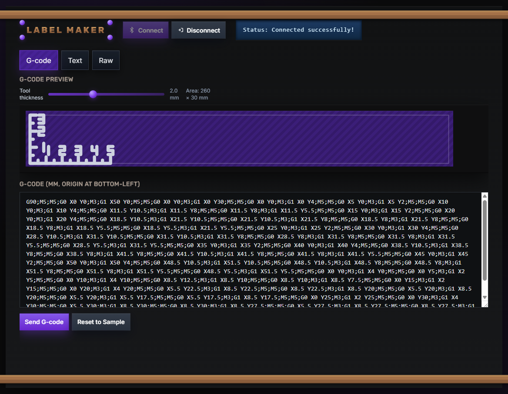

# Label Maker (Arduino Nano ESP32)

Build a simple label plotter that draws on tape. You can control it with joystick, from a web page over Bluetooth, or by sending tiny programs (G‑code).

This project is based on the CrunchLabs Hackpack “Label Maker.” Full credit to CrunchLabs for the original idea and build. Original: https://www.crunchlabs.com/products/label

This version swaps in an Arduino Nano ESP32 so it can talk over Bluetooth Low Energy (BLE) and print from a tiny web page.

## Example prints

### Ruller printed on a tape

### Crunch Labs Logo

---

## What you’ll make (for beginners)

- A small machine with 2 stepper motors and a pen that draws letters and shapes on label tape.
- You can use the on‑board buttons and LCD, or connect from your phone or computer over Bluetooth.
- There’s a simple web page (`web-client.html`) to connect, type text, and print.

---

## What changed from the original?

- Controller swap: Arduino Nano → Arduino Nano ESP32 (built‑in BLE). Wiring stays the same, so you can reuse your build.
- New features:
  - Bluetooth control: pen up/down, print text, and send G‑code.
  - A tiny web client that runs in Chrome/Edge using Web Bluetooth.
- Libraries: uses NimBLE (BLE) and ESP32Servo; everything is installable from Arduino IDE.
  - **WARNING:** `ESP32Servo` did not work for me in latest version (3.0.8), so I installed 3.0.7 instead
- Joystick analog reads did not wrk on ESP32 - I had some issues as the resting state was around 75% of the max, which tells me that the analogRead is non-linear on ESP32. I fixed it with some naive offset.

---

## Features at a glance

- Draws vector letters and shapes on label tape (original Hackpack behavior kept).
- Local control with joystick/button and a 16×2 I2C LCD.
- BLE control from phone/PC:
  - Send text to print.
  - Raise/lower the pen.
  - Send small G‑code programs to draw shapes.
- After a print, it moves the carriage right and returns Y to 0 so you’re ready for the next label.

Tip: Keep drawings within about 260 mm (X) by 30 mm (Y).

---

## What you need

- Arduino Nano ESP32 (by Arduino)
- CrunchLabs Label Maker Hackpack (or equivalent mechanics):
  - 16×2 I2C LCD (address 0x27 is common)
  - 2 stepper motors with drivers (to pins 2–5 and 6–9)
  - Joystick with push button (X=A2, Y=A1, button=A0)
  - Small servo for the pen lifter (D13)
  - USB cable for programming
  - Case/printed parts from the kit

Wiring matches the original Hackpack pinout, so you don’t need to rewire.

---

## Quick start (Arduino IDE)

1) Install Arduino IDE 2.
2) Install the board package:
   - Tools → Board → Boards Manager…
   - Search “Arduino ESP32” (by Arduino) and install
   - Select board: Tools → Board → Arduino ESP32 → Arduino Nano ESP32
3) Open this project: File → Open… → choose `label-maker.ino` in this folder
4) Install libraries (Library Manager):
   - LiquidCrystal I2C
   - ezButton
   - ESP32Servo
   - Stepper is built‑in. BLE (NimBLE) comes with the ESP32 board package.
5) Plug in the Nano ESP32, choose the COM port (Tools → Port), and click Upload

You should see “Initializing…” on the LCD, the servo twitch, and the steppers home.

---

## Try the Web Bluetooth page

`web-client.html` is a tiny page that runs in Chrome/Edge on desktop and Android. It talks to the label maker over BLE.

Steps:
- Open `web-client.html` (double‑click the file or drag it into a browser tab)
- Click “Connect” and pick the device named `LABEL MAKER`
- Try the buttons:
  - Pen Down / Pen Up
  - Type some text and click “Send Text”
  - Click “Send Sample G‑code” (draws a rectangle in bounds)
- The page shows a simple drawing preview. The “tool thickness” slider only changes the preview’s line width.

Note: Some browsers don’t support Web Bluetooth (e.g., iOS Safari). Use Chrome/Edge on desktop, macOS, or Android.

---

## G‑code (kid‑friendly mini intro)

G‑code is a list of short commands that tell machines where to move.

- Units: millimeters (mm). The corner (0,0) is the bottom‑left.
- Modes: G90 = absolute, G91 = relative.
- Moves: G0 = move with pen up (no drawing), G1 = draw a straight line.
- Pen: M3 = pen down, M5 = pen up. M300 S… also works (small S = down, big S = up).

Quick test program (draws a rectangle):

`G90;M5;G0 X0 Y0;M3;G1 X20 Y0;G1 X20 Y10;G1 X0 Y10;G1 X0 Y0;M5`

After a job, the machine nudges right and returns Y to 0 with the pen up.

---

## Advanced: BLE command reference

Commands are plain text written to a single BLE characteristic. Format:

- `command,params`  ← the comma is required (params may be empty)

Supported commands:
- `print-text,<your text>` → prints vector text
- `pen-up,`                → lifts the pen
- `pen-down,`              → lowers the pen
- `print-raw,<gcode>`      → runs a short G‑code program

For larger programs, send in chunks:
- `print-raw-begin,`
- `print-raw-data,<chunk>` (repeat)
- `print-raw-end,`

If you forget the comma, the command is ignored.

BLE basics for this project:
- Peripheral: the label maker (waits to be connected)
- Central: your phone/computer (connects and sends data)
- Service UUID: `12345678-1234-5678-1234-56789abcdef0`
- Characteristic UUID: `87654321-4321-8765-4321-87654321fedc`
- Properties: Write, Read (usually empty after handling), Notify (reserved for future status)

Security: No pairing by default; anyone nearby could connect. Turn it off when not in use.

---

## Tips and troubleshooting

- Can’t connect over BLE?
  - Power‑cycle the board and try Connect again.
  - Make sure your browser supports Web Bluetooth.
- Sent a command but nothing happened?
  - Make sure there’s a comma: `pen-up,`
- Text looks squashed or off the tape?
  - Keep drawings within ~260×30 mm.
  - Press the tape down firmly on the holder.

---

## Optional: For curious builders

- Using VS Code: open this folder in VS Code. There are tasks for “Compile” and “Upload” that call `arduino-cli` for the Nano ESP32.
- Built with help from GitHub Copilot - Highly recommended when you write some code for your robot, but it doesn't work and you don't know why.
- How the BLE protocol works: send simple text like `print-text,Hello` or `print-raw,<gcode>`. For big G‑code, stream with begin/data/end.
- Web Bluetooth lets websites talk to BLE devices; `web-client.html` is a tiny example.
- What is G‑code? A common language for machines like 3D printers and CNC. We use a tiny subset here with hope, that dedicated plotting software for laser cutters and cnc machines will be able to prepare gcode for our label maker.

---

## License

MIT License. See the header in `label-maker.ino`.

---

## Credits

- Original concept and build: CrunchLabs Hackpack “Label Maker” — https://www.crunchlabs.com/products/label
- BLE built on NimBLE for ESP32; pen control uses ESP32Servo.
- The G‑code bridge converts millimeters to device “steps” so motion matches real distances.

Happy labeling!
